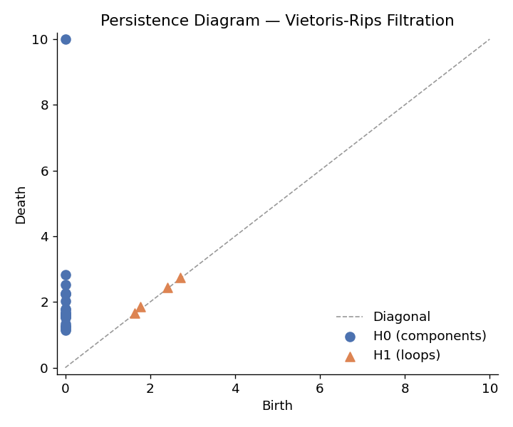
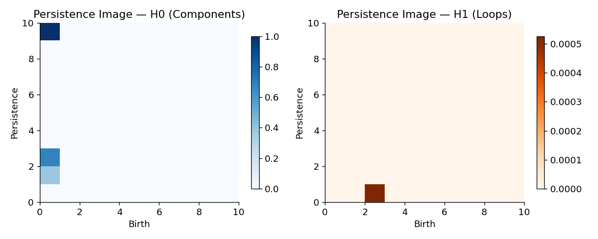
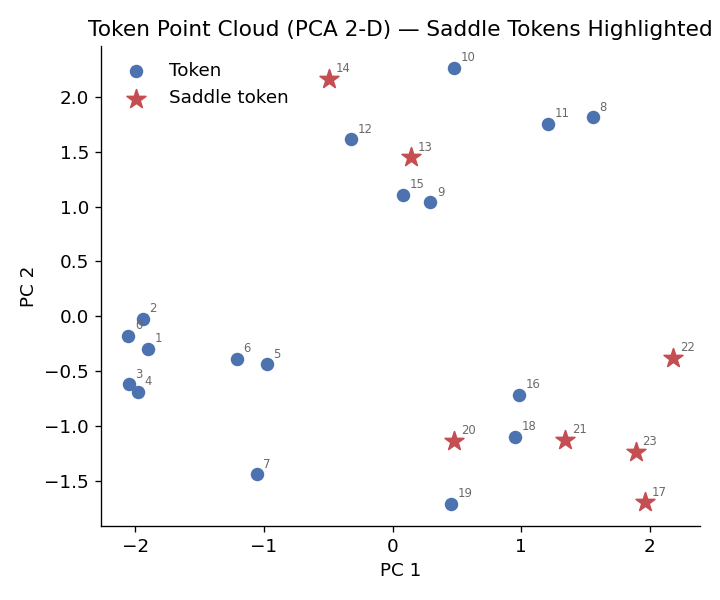
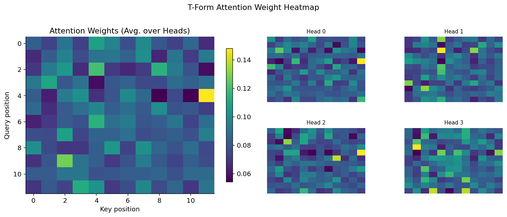
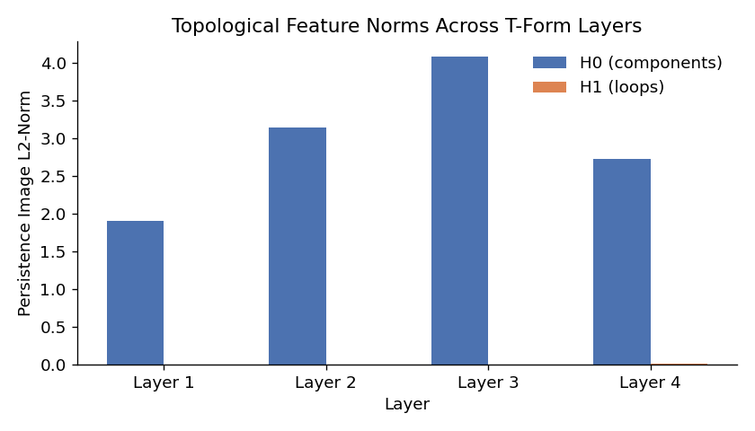
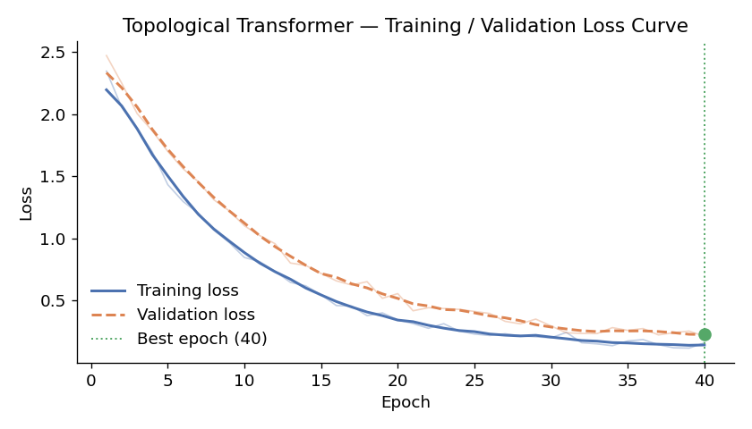

# The Topological Transformer (T-Form)

> **A Transformer architecture augmented with Topological Data Analysis (TDA).**  
> Each attention layer reads the *shape* of the input token cloud — not just
> pairwise similarities — and uses that global structural signal to bias
> attention, letting the model reason about connectivity, loops, and
> bridging tokens.

---

## Table of Contents

1. [Overview](#overview)
2. [Architecture](#architecture)
   - [TDA Layer — Vietoris-Rips Filtration](#tda-layer--vietoris-rips-filtration)
   - [Topological Encoding — Persistence Images](#topological-encoding--persistence-images)
   - [Topo-Attention](#topo-attention)
   - [Saddle-Point Features](#saddle-point-features)
   - [Differentiability Bridge](#differentiability-bridge)
3. [Graphs](#graphs)
4. [Installation](#installation)
5. [Quick Start](#quick-start)
6. [Generating Visualizations](#generating-visualizations)
7. [Running Tests](#running-tests)
8. [Project Structure](#project-structure)

---

## Overview

Standard Transformers treat a sequence of tokens as a *set* of vectors and
measure relevance through dot-product similarity.  They are blind to the
global topological structure of the token cloud — whether tokens form
clusters, whether there are loops or "holes" in the latent space, or which
token sits at a structural bridge between two otherwise disconnected groups.

**T-Form** fixes this by running a lightweight, frozen
[Vietoris-Rips](https://en.wikipedia.org/wiki/Vietoris%E2%80%93Rips_complex)
filtration on each sequence's token embeddings (treated as a point cloud)
and converting the resulting persistence diagrams into fixed-size
*persistence image* vectors.  A small trainable MLP maps these vectors to
an additive bias term injected directly into the scaled dot-product
attention logits.  Additionally, tokens that sit at structural saddle points
(i.e., tokens whose removal would merge two previously disjoint components)
receive a separate learnable bias so the model can learn to route
information through them.

Because Gudhi's Rips computation is non-differentiable, all TDA calls are
wrapped in `torch.no_grad()` and the downstream MLP (which is
differentiable) carries the gradient signal.  The result is a fully
end-to-end trainable model.

---

## Architecture

```
Input  (B, L, D)
   │
   ├─────────────────────────────────────────────────────────┐
   │   TDA Layer (frozen, no_grad)                           │
   │                                                          │
   │   Point cloud  ──► Vietoris-Rips filtration             │
   │                         │                               │
   │              ┌──────────┴───────────┐                   │
   │           H0 diagram             H1 diagram             │
   │        (components)               (loops)               │
   │              │                       │                  │
   │        Persistence Image      Persistence Image         │
   │         (10×10 grid)           (10×10 grid)             │
   │              └──────────┬───────────┘                   │
   │                  concat (200-D vector)                   │
   │                         │                               │
   │              TopologicalBiasNet (MLP, trainable)        │
   │                         │                               │
   │                  scalar bias  Φ(PD)                     │
   │                                                          │
   │   Saddle detection ──► saddle_mask  (B, L)  bool        │
   │                         │                               │
   │              SaddlePointEmbedding (learnable scalar)    │
   │                         │                               │
   │                  saddle bias  S                         │
   └─────────────────────────────────────────────────────────┘
           │                      │
           ▼                      ▼
      Q, K, V projections    Φ(PD) + S
           │                      │
           └──────────┬───────────┘
                      ▼
         Attention(Q,K,V) = Softmax( QKᵀ/√dₖ + Φ(PD) + S ) V
                      │
                   W_o projection
                      │
              + residual connection
              LayerNorm
              Feed-Forward Network (GELU, pre-LN)
              + residual connection
                      │
                 Output (B, L, D)
```

### TDA Layer — Vietoris-Rips Filtration

The L token embeddings for each sequence are treated as a **point cloud**
in ℝᴰ (PCA-projected to ℝ³² when D > 32 for tractability).  The Gudhi
library builds a Vietoris-Rips simplex tree and computes persistent
homology, yielding:

| Dimension | Name | What it captures |
|-----------|------|-----------------|
| H0 | Connected components | How many separate clusters exist and when they merge |
| H1 | Loops / 1-cycles | Circular structures or "holes" in the token arrangement |

Each persistence class is represented as a **(birth, death)** pair — a
point above the diagonal in the persistence diagram.  Points far from the
diagonal represent long-lived (topologically significant) features.

### Topological Encoding — Persistence Images

Raw persistence diagrams are of variable size, making them incompatible
with fixed neural network inputs.  T-Form converts them to **persistence
images** — a fixed-size 2-D grid over the (birth, persistence) plane where
each persistence point contributes a weighted Gaussian kernel:

```
persistence = death − birth

PI[i,j] = Σ_k  weight(pₖ) · Gauss(bₖ, pₖ; σ)   evaluated on a 10×10 grid
```

A linear weight `w = persistence / max_val` suppresses near-diagonal noise.
The H0 and H1 images are flattened and concatenated into a 200-dimensional
vector fed to `TopologicalBiasNet`.

### Topo-Attention

The core formula replaces standard scaled dot-product attention:

```
Attention(Q, K, V) = Softmax( QKᵀ / √dₖ  +  Φ(PD)  +  S ) · V
```

Where:
- **Φ(PD)** — output of a 3-layer MLP applied to the 200-D persistence
  image vector; broadcast as a scalar bias over all (L, L) query–key pairs.
- **S** — a learnable scalar added at rows and columns corresponding to
  saddle tokens, initialized to zero.

### Saddle-Point Features

A *saddle token* is the token closest to the filtration radius at which
two connected components merge (i.e., the token bridging a "gap" in the
point cloud).  These tokens act like logical connectives in the sequence.

T-Form detects saddle tokens by finding, for each H0 persistence pair with
lifetime above the median, the token whose nearest-neighbour distance most
closely matches the merge radius.  Detected saddle indices are passed to
`SaddlePointEmbedding`, which adds a learnable scalar offset to those
positions' rows and columns in the attention logit matrix.

### Differentiability Bridge

Gudhi's Rips computation is **non-differentiable**.  T-Form handles this
via the *Persistence Image Path*:

1. All TDA calls live inside `@torch.no_grad()` — they produce fixed numpy
   arrays and do not participate in the autograd graph.
2. The persistence image vector (a plain float tensor) is then passed into
   `TopologicalBiasNet`, a standard `nn.Sequential` MLP whose parameters
   receive gradients normally.
3. Saddle indices are boolean masks that select positions; `SaddlePointEmbedding`
   holds a single learnable `nn.Parameter` that scales those positions.

The gradient therefore flows: `loss → attention output → topo_bias_net
parameters`, keeping the full PyTorch autograd graph intact.

---

## Graphs

All graphs are generated by [`visualize.py`](visualize.py) and saved to the
[`graphs/`](graphs/) directory.  Re-generate at any time with:

```bash
python visualize.py
```

### 1 — Persistence Diagram

Birth/death scatter for H0 (connected components, blue circles) and H1
(loops, orange triangles) produced by the Vietoris-Rips filtration on a
synthetic 24-token cloud.  Points further from the diagonal are
topologically more significant.



---

### 2 — Persistence Images

The persistence diagrams converted to fixed-size heatmaps on the
(birth, persistence) plane.  These are the actual vectors fed into the
`TopologicalBiasNet` MLP.  Brighter regions indicate more persistent
topological features at those (birth, persistence) coordinates.



---

### 3 — Token Point Cloud with Saddle Tokens

PCA 2-D projection of the 24-token synthetic cloud.  Tokens identified as
**saddle points** — bridges between otherwise disconnected components — are
marked with a red star ★.  These are the positions that receive the extra
learnable bias offset in the attention logits.



---

### 4 — Attention Weight Heatmap

T-Form attention weights on a random 12-token input, including the
topological bias Φ(PD) and the saddle-point bias S.  The left panel shows
the average over all heads; the right panel shows the first four individual
heads.



---

### 5 — Topological Feature Norms Across Layers

L2-norm of the H0 (blue) and H1 (orange) persistence image vectors at the
input to each transformer layer.  The norms track how the topological
structure of the token cloud evolves as representations are refined through
the network.



---

### 6 — Training / Validation Loss Curve

Illustrative training and validation loss curves for a T-Form model, with a
smoothed trend line and a green marker at the best validation epoch.



---

## Installation

```bash
# 1. Clone
git clone https://github.com/arnavd371/The-Topological-Transformer.git
cd The-Topological-Transformer

# 2. Install dependencies
pip install -r requirements.txt
```

**Dependencies** (`requirements.txt`):

| Package | Version | Purpose |
|---------|---------|---------|
| `torch` | ≥ 2.0.0 | Tensor operations, autograd, neural network layers |
| `numpy` | ≥ 1.24.0 | Numerical array operations |
| `scipy` | ≥ 1.10.0 | SVD-based PCA projection |
| `gudhi` | ≥ 3.8.0 | Vietoris-Rips filtration and persistent homology |
| `matplotlib` | ≥ 3.7.0 | Visualization / graph generation |

> **Note:** If `gudhi` is not installed, T-Form falls back to zero
> topological features (the model still runs, just without TDA).

---

## Quick Start

```python
import torch
from tform import TopologicalTransformer

# Instantiate the model
model = TopologicalTransformer(
    d_model=256,      # embedding dimension
    num_heads=8,      # attention heads (must divide d_model)
    num_layers=4,     # stacked transformer layers
    max_seq_len=512,  # maximum sequence length
    dropout=0.1,
)

# Forward pass — input shape: (batch, seq_len, d_model)
x = torch.randn(2, 16, 256)
out = model(x)          # → (2, 16, 256)
print(out.shape)        # torch.Size([2, 16, 256])
```

### Using with an attention mask

```python
# True positions are masked (ignored) in attention
mask = torch.zeros(2, 16, dtype=torch.bool)
mask[0, 12:] = True   # batch item 0: last 4 tokens are padding

out = model(x, mask=mask)
```

### Using individual sub-modules

```python
from tform import TopologicalAttention, TopologicalTransformerLayer

# Single attention layer
attn = TopologicalAttention(d_model=64, num_heads=4)
y = attn(torch.randn(1, 8, 64))   # (1, 8, 64)

# Single transformer layer (attention + FFN + LayerNorm)
layer = TopologicalTransformerLayer(d_model=64, num_heads=4)
y = layer(torch.randn(1, 8, 64))  # (1, 8, 64)
```

---

## Generating Visualizations

```bash
python visualize.py
```

This runs the full T-Form pipeline on synthetic data and saves six
diagnostic PNG files to `graphs/`:

| File | Description |
|------|-------------|
| `01_persistence_diagram.png` | H0 & H1 birth/death scatter (Vietoris-Rips) |
| `02_persistence_image.png` | H0 & H1 persistence image heatmaps |
| `03_point_cloud_saddles.png` | PCA token cloud with saddle tokens highlighted |
| `04_attention_weights.png` | Attention weight heatmap (avg + per-head) |
| `05_topo_feature_norms.png` | Per-layer persistence feature L2-norms |
| `06_loss_curve.png` | Smoothed training / validation loss curve |

---

## Running Tests

```bash
pip install pytest
pytest test_tform.py -v
```

The test suite covers:

| Test class | What it checks |
|------------|----------------|
| `TestPersistenceDiagrams` | Output shapes, no infinities, birth ≤ death |
| `TestPersistenceImage` | Output length, zeros on empty diagram, non-negativity |
| `TestSaddleDetection` | Return type, index bounds, empty-diagram edge case |
| `TestPCAProject` | Output shape, rank does not exceed input rank |
| `TestTopologicalAttention` | Shape, finite outputs, gradient flow, mask, invalid config |
| `TestTopologicalTransformerLayer` | Shape, residual connection |
| `TestTopologicalTransformer` | Shape, determinism, batch-1, varying lengths, parameter count |

---

## Project Structure

```
The-Topological-Transformer/
├── tform.py            # Core model — all classes and TDA utilities
├── visualize.py        # Matplotlib graph generation script
├── test_tform.py       # Pytest test suite (27 tests)
├── requirements.txt    # Python dependencies
├── graphs/             # Pre-generated diagnostic PNG graphs
│   ├── 01_persistence_diagram.png
│   ├── 02_persistence_image.png
│   ├── 03_point_cloud_saddles.png
│   ├── 04_attention_weights.png
│   ├── 05_topo_feature_norms.png
│   └── 06_loss_curve.png
└── README.md
```

### Key classes in `tform.py`

| Class / Function | Role |
|-----------------|------|
| `_compute_persistence_diagrams` | Gudhi Vietoris-Rips → H0, H1 diagrams |
| `_persistence_image` | Converts a diagram to a fixed-size image vector |
| `_detect_saddle_indices` | Identifies bridging tokens from H0 diagram |
| `_pca_project` | PCA dimensionality reduction for large D |
| `TopologicalBiasNet` | MLP: persistence image → scalar attention bias |
| `SaddlePointEmbedding` | Learnable bias at saddle token positions |
| `TopologicalAttention` | Full topo-augmented multi-head attention layer |
| `TopologicalTransformerLayer` | Attention + FFN + LayerNorm residual block |
| `TopologicalTransformer` | Complete stacked T-Form model |